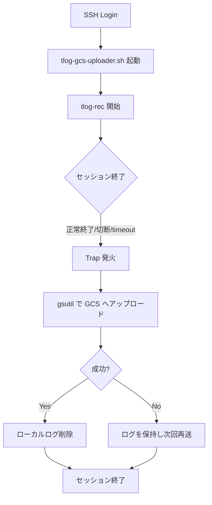

# Tlog GCS Uploader for Bastion Server 🚀

`tlog` を使用して、Google Compute Engine (GCE) 踏み台サーバー上の全セッション操作（標準入出力）を記録し、ログを直接 Google Cloud Storage (GCS) へ保存するための堅牢なソリューションです。

---

## 💡 特徴

- **自動セッション記録**: SSH ログイン時に `tlog-rec` が自動起動し、全操作を JSON 形式でキャプチャ。
- **高信頼な転送 (Signal Trapping)**: ブラウザを閉じた場合やタイムアウト（`SIGHUP`, `SIGTERM`, `EXIT`）でも、ログを確実に GCS へアップロード。
- **インテリジェント・リカバリ**: 万が一の転送失敗時も、次回ログイン時に未送信ログをバックグラウンドで自動再送。
- **ストレージ最適化**: セッション終了時にログを直接 GCS へ移行。サーバー上のログは自動削除され、ディスク圧迫を防ぎます。
- **運用フレンドリー**: 動作状況は syslog (`journalctl`) でリアルタイム監視可能。デバッグモードも完備。
- **安全なデプロイ**: `sshd -t` によるバリデーションを含む専用デプロイスクリプトを提供。

---

## 🛠 ワークフロー



---

## 📋 導入の準備 (Prerequisites)

### 1. 対象 OS
- **Rocky Linux 8** (Google Optimized 推奨)
- その他 `tlog` 及び `google-cloud-cli` が利用可能な Linux 環境

### 2. GCP 権限 & スコープ
インスタンスのサービスアカウントには以下が必要です。

| 項目 | 必要な設定 |
| :--- | :--- |
| **IAM ロール** | `Storage オブジェクト作成者`, `Storage レガシー バケット読み取り` |
| **アクセススコープ** | `すべての Cloud API に完全なアクセス権を許可` または `ストレージ: 読み書き` |

> [!CAUTION]
> アクセススコープが「既定」の場合、書き込み権限不足でアップロードに失敗します。

---

## 🚀 クイックスタート

### ステップ 1: 依存パッケージのインストール
```bash
sudo dnf update -y
sudo dnf install -y tlog google-cloud-cli
```

### ステップ 2: スクリプトの設定
`tlog-gcs-uploader.sh` の 12 行目付近にある `GCS_BUCKET` を自身のバケット名に書き換えます。

```bash
readonly GCS_BUCKET="gs://YOUR_BUCKET_NAME"
```

### ステップ 3: デプロイ
スクリプトに実行権限を与え、デプロイを実行します。

```bash
chmod +x deploy.sh
sudo ./deploy.sh
```
※ `deploy.sh` はスクリプトの配置、SSHD 設定の適用、設定の検証、SSHD の再起動までをワンストップで行います。

---

## 🔍 運用とトラブルシューティング

### 動作ログの確認
動作の詳細は `journalctl` でリアルタイムに監視できます。

- **エラーの監視**: `journalctl -t tlog-gcs-uploader -p err -f`
- **詳細ログ (Debug)**: `journalctl -t tlog-gcs-uploader -p debug -f`

### ログの再生
監査時は GCS からログを取得し、`tlog-play` で内容を確認できます。

```bash
# GCS から DL
gsutil cp gs://YOUR_BUCKET_NAME/<user_name>/<file_name>.log ./

# 再生
tlog-play --reader=file --file-path=<file_name>.log
```

### よくある問題
- **ログイン直後に切断される**: `tlog` がインストールされているか、または GCS への疎通（スコープ）を確認してください。
- **アップロードされない**: `journalctl` でエラーコードを確認してください。多くの場合、認証かバケット名の設定ミスです。

---

## 📚 関連情報
- [詳細な構築手順書 (manuals.md)](./docs/manuals.md)
- [tlog 公式ドキュメント](https://github.com/Scribery/tlog)